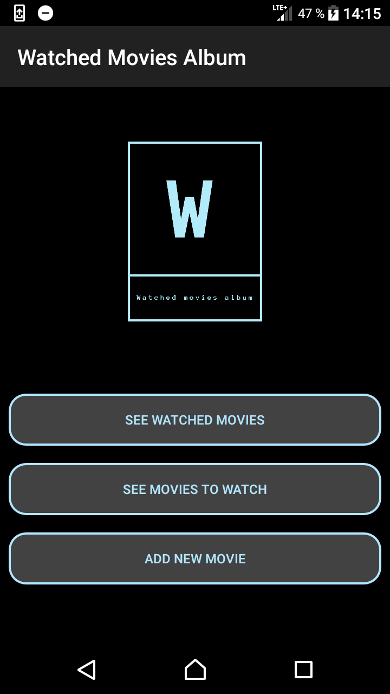
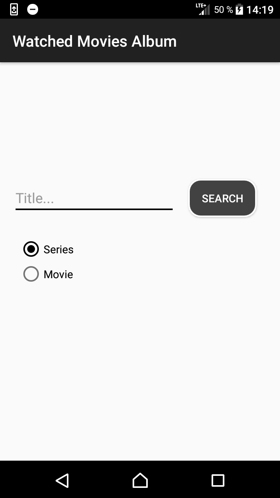
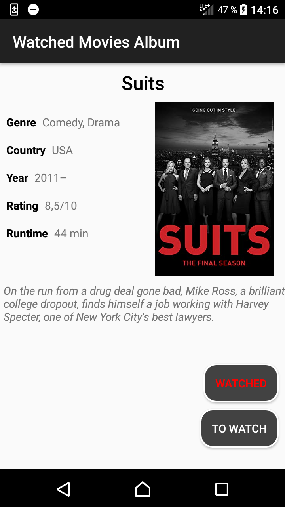
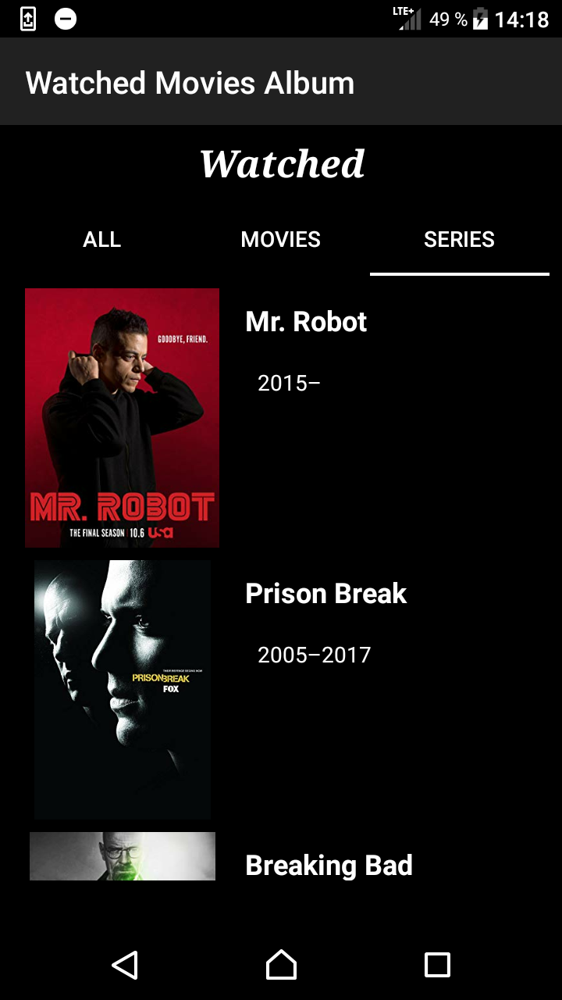
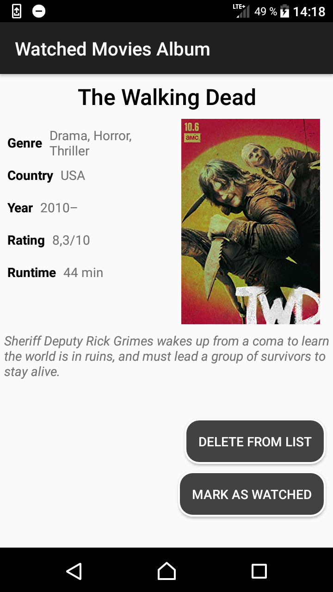

# WatchedMoviesAlbum_AndroidApp
Android application, created for my own personal use, to mark down series and movies that I've watched or that I am going to watch.

## 1. What does the app do? 
The Watched Movies Album application was created due to my personal need of remembering series and movies that I've watched or that I am going to watch. The app enables client to search for movie or series and then add it to adequate list ('to watch' or 'watched'). Movies from list 'to watch' can be moved to list 'watched'. When searching, movies that already are on lists have highlighted adequate buttons (red color). 

## 2. Used libraries and technologies 
* App was written completely in **Kotlin**.
* **'The Room'** library was used with **NoSQL** to save content of lists.
* Movie's description is downloaded with **Retrofit** using IMDB API. 
* The lists are presented by use of **RecyclerView**, **Fragments** and **PagerView**.

Main classes can be found here: *app/src/main/java/com/example*

 

